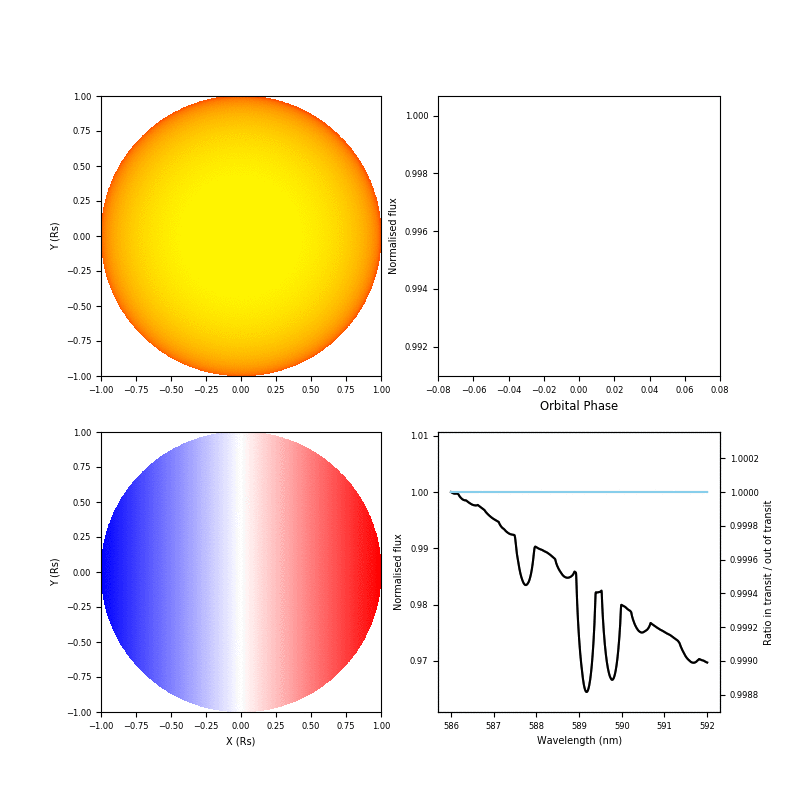
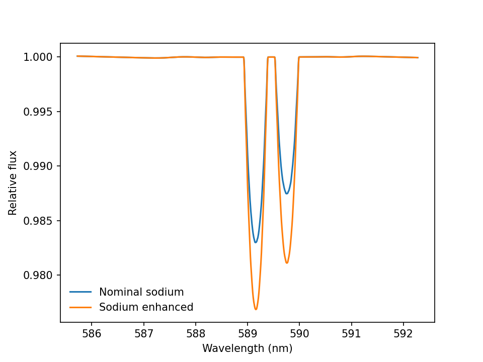
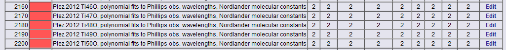

# StarRotator

StarRotator is a package that simulates a rotation-broadened stellar spectrum during an exoplanet transit event. The simulation is done via numerical integration of the stellar disk, with model photosphere spectra from either PHOENIX or pySME.

#### This is a minimal guide for getting StarRotator to run.

StarRotator will run out of the box using a default exoplanet system defined in prepackaged configuration files (the demo `.txt` files included in the `./input/` folder).
In order to run StarRotator, perform the following steps:
1) Clone the repo / pull it to your machine.
2) To begin, open python in the root folder and hit `from StarRotator import StarRotator, test_StarRotator`.
3) Run `testStarRotator()` to test that StarRotator functions normally. Functionality with PHOENIX models is possible even if you do not have pySME installed.
4) StarRotator can be called as `KELT9 = StarRotator(586.0,592.0,200.0)` for a model spectrum of the Na-D lines of KELT-9, a fast-rotating 10,000K A-star orbited by KELT-9b, computed on a grid of (2x200)x(2x200) i.e. 400x400 square pixels.
5) Access the simulation output using attributes defined on the `KELT9` object: The wavelength axis of the model is accessed as `wl = KELT9.wl`, the out-of-transit stellar spectrum as `F_out = KELT9.stellar_spectrum`, the modelled time-series as `spectra = KELT9.spectra` and the residuals as obtained by dividing the out-of-transit spectrum out of the time-series: `residuals = KELT9.residual`. These can be blurred to some spectral resolution defined in `KELT9.R` (defined by default as 115,000 in the `demo_star.txt` parameter file), using `KELT9.convolve_spectral_resolution()`. Convolution is applied to the residuals and not to the spectra that are divided by each other, because this introduces a numerical error.
6) The StarRotator object contains methods to plot the simulation output. You can instantly plot the residuals of the time series like `KELT9.plot_residuals()`, and an animation of the entire time-series as `KELT9.animate()`, the result of which could look like the animation below.
7) To use the simulation output, the user has access to the `KELT9.residual` numpy array, which can be written to file and loaded it when needed in an external workflow, or used as is.
8) To change the parameters of your exoplanet system you can create new input files. The parameters in the input files need to be given in the exact same order as in the demo files. Alternatively, you can call the StarRotator object with a dictionary that contains all these input values. See the example code block below':

```python
#When using the input files:
Planet = StarRotator(586.0,592.0,200.0,star_path='input/demo_star.txt',planet_path='input/demo_planet.txt',obs_path='input/demo_observations.txt')


#When using the dictionary:
dict = {
  'veq':114000.0, #
  'stelinc':90.0, #stellar inclination axis, degrees, float
  'drr':0.0, #Differential rotation parameter, float
  'T':10000.0, #Stellar effective temperature, K, float
  'FeH':0.0, #metallicity, float
  'logg':4.0, #log(g), cgs, float
  'u1':0.93, #limb darkening parameter 1
  'u2':-0.23, #limb darkening parameter 2
  'R':115000, #Spectral resolution
  'mus':0, #number of mu angles, int. Ignored if using PHOENIX.
  'model':'phoenix', #model type, string, either phoenix or pySME
  'sma_Rs':3.153, #a over Rs, float
  'e':0.0, #eccentricity, float
  'omega':0.0, #longitude of periastron, degrees, float
  'inclination':86.79, #degrees, float
  'obliquity':-84.8, #degrees, float
  'RpRs':0.08228, #Planet star radius ratio, float
  'P':1.4811235, #Orbital period, days, float
  'phases':[-0.02,-0.01,0.0,0.01,0.02] #numpy array, set to the orbital phases of the time series
}

Planet = StarRotator(586.0,592.0,200.0,input=dict)
```



<br><br><br>

### A typical use case: running StarRotator with pySME as a forward model.

[PySME](https://github.com/AWehrhahn/SME) is used in StarRotator to allow a user to generate more precise forward-models of the Doppler-Shadow residuals for real exoplanet systems. Using known stellar parameters (T, log(g), Z, vsin i) and individual elemental abundances, in theory it should be possible to precisely forward model the residual and recalibrate observed spectra. To the broadened spectrum in the Na lines in a sodium-rich variation on the KELT-9 system with pySME, you can use the following example.


```python

from StarRotator import StarRotator
import matplotlib.pyplot as plt
import numpy as np

dict = {
  'veq':114000.0,'stelinc':90.0,'drr':0.0,
  'T':10500.0,'FeH':0.23,'logg':3.9,'u1':0.93,'u2':-0.23,
  'R':115000,'mus':5,'model':'pySME',
  'sma_Rs':3.153,'e':0.0,'omega':0.0,'inclination':86.79,'obliquity':-84.8,'RpRs':0.08228,
  'P':1.4811235,'phases':np.arange(-0.03,0.03,40),'grid_model':'atlas12.sav','abund':{},
  'linelist_path':'input/demo_linelist.dat'
}

KELT9_nominal = StarRotator(586.0,592.0,200.0,input=dict)

dict['abund']=["{'Na':6.6}"]#Nominally it is 6.4
KELT9_rich = StarRotator(586.0,592.0,200.0,input=dict)

plt.plot(KELT9_nominal.wl,KELT9_nominal.stellar_spectrum,label='Nominal sodium')
plt.plot(KELT9_rich.wl,KELT9_rich.stellar_spectrum,label='Sodium enhanced')
plt.legend(frameon=False)
plt.xlabel('Wavelength (nm)')
plt.ylabel('Relative flux')
plt.show()

```

This creates the following figure of the out-of-transit broadened stellar sodium lines. Adding extra broadening to account for the instrumental resolving power and  accessing the residuals can subsequently be done via `KELT9_rich.convolve_spectral_resolution()` and `KELT9_rich.residuals()`. In addition, in reality you will wish to use more complete line-lists (in VALD format) and data-driven stellar and system parameters. All this is left for the user to explore.


### VALD service for atomic and molecular data. i.e. line lists


The Vienna Atomic Line Database (VALD) is a collection of atomic and molecular energy level transition parameters of astronomical interest. VALD provides tools to extract a list of energy level transition parameters, a so-called line list, within a given energy range (wavelength range). An email is required for registration, as this is where you recieve download links. Note that the service only works in wavelengths in air and species that are given with ionisation in integer format, i.e. Fe 1 for neutral iron.

You will find the service at this website: http://vald.astro.uu.se/~vald/php/vald.php

It is possible to view a very short range of wavelengths directly via the web interface, but the most interesting feature is the "Extract All" function, which allows you to download all energy level transitions in a given wavelength range.

A few tips on configuring your data request:
1) Choose "long format" for your data, as this will allow your synthesis code to access more information, which may be needed if you are modelling NLTE in spectroscopy, for example.
2) Choose FTP as your delivery platform, this is necessary above a certain size, which is not that large.
3) Yes, include HFS splitting unless you know you don't need it.
4) Don't require known values unless you know you will need them.
5) Choose a custom line list configuration (more details below).
6) Stick to the default units, as these are the units used in most popular spectral synthesis codes, in particular PySME.

#### Custom line list configuration

The data for some of the molecules is extensive and will quickly fill your download quota if you include them in your requests. In particular, the TiO data is a culprit, so it is highly recommended that you omit this molecule from your Extract All requests for most purposes.

The custom linelist configuration is attached to your login, so you only need to configure this once. You can click on "Linelist Configuration" on the Extract All page or go to
http://vald.astro.uu.se/~vald/php/vald.php?page=persconf

To remove the TiO lines go down to: Plez 2012 Ti46O, polynomial fits to Phillips obs. wavelengths, Nordlander molecular constants
You wlil see an "X" in the Active? column. Select Edit and remove the X. Do it for all isotopes. Afterwards it should look like this:


After the first query, check the wavelength of the last entry. If the last entry is not the desired final wavelength, make a new query starting from the last wavelength. If you end up with several files, simply stitch them together at the end. The headers will be the same in all files and must only be present once in the first two lines of the final file. Make sure that the references at the end of each file are collected at the end of the final file, as references in the middle of a line list file can confuse the PySME parser.

A VALD line list file typically looks like this:

```
                                                                     Lande factors        Damping parameters
Elm Ion       WL_air(A)  log gf* E_low(eV) J lo  E_up(eV) J up   lower   upper    mean   Rad.  Stark    Waals
'Fe 1',      3000.00258,  -4.771,  3.3009,  2.0,  7.4325,  3.0,  1.180,  0.720,  0.260, 7.310,-4.180,-7.320,
  LS                                                                      3d7.(2D2).4s a3D
  JK                                                              3d7.(4F<3/2>).4f 2[7/2]*
'_          Kurucz Fe I 2014   1 wl:K14   1 gf:K14   1 K14   1 K14   1 K14   1 K14   1 K14   1 K14   1 K14    Fe'
'Fe 1',      3000.02013,  -8.668,  3.3320,  5.0,  7.4636,  5.0,  1.400,  1.230,  1.310, 7.380,-3.590,-7.180,
  LS                                                             3d6.(5D).4s.4p.(3P*) z5F*
  JK                                                            3d6.4s.(6D<3/2>).5g 2[9/2]
'_          Kurucz Fe I 2014   1 wl:K14   1 gf:K14   1 K14   1 K14   1 K14   1 K14   1 K14   1 K14   1 K14    Fe'

[...skipping a lot of lines...]

'Fe 1',      4199.98361,  -5.305,  0.0873,  2.0,  3.0385,  2.0,  1.500,  2.330,  1.920, 3.140,-6.170,-7.820,
  LS                                                                           3d6.4s2 a5D
  LS                                                             3d6.(5D).4s.4p.(3P*) z7P*
'_          Kurucz Fe I 2014  11 wl:K14  11 gf:K14  11 K14  11 K14  11 K14  11 K14  11 K14  11 K14  11 K14    Fe'
'Ca 1',      4199.98872,  -2.561,  4.5347,  2.0,  7.4859,  2.0,  1.500,  1.180,  1.340, 7.510,-3.740,-6.880,
  LS                                                                         3p6.4s.5p 3P*
  LS                                                                          3p6.3d.7d 1D
'_      A   Kurucz CaI 2007    1 wl:K07   1 gf:K07   1 K07   1 K07   1 K07   1 K07   1 K07   1 K07   1 K07    Ca'
* oscillator strengths were scaled by the solar isotopic ratios.
 References:
  1. Kurucz obs. energy level: Fe 1
  2. Kurucz obs. energy level: Mn 2
  3. Kurucz obs. energy level: O 4
  4. Kurucz obs. energy level: Cr 2
[...can be many references...]
```

To import the line list into your PySME code, use this code snippet:

```
from pysme.sme import SME_Structure
sme = SME_Structure()

from pysme.linelist.vald import ValdFile
sme.linelist = ValdFile(vald_line_list_file_name)
```
