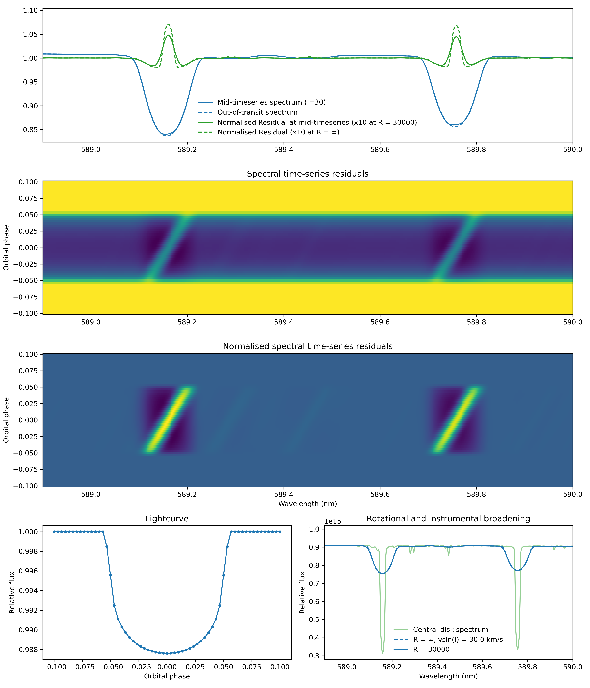
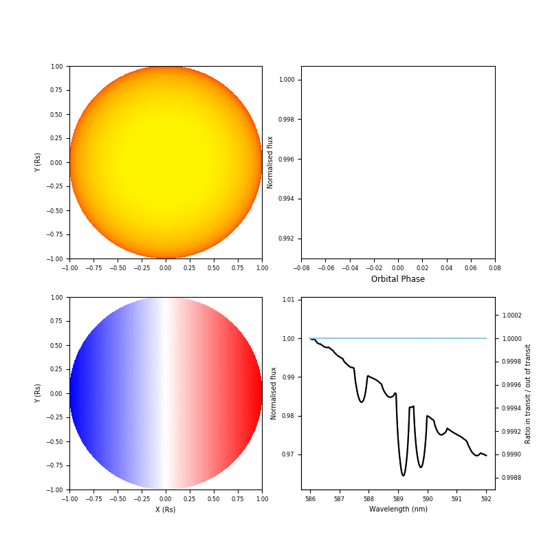
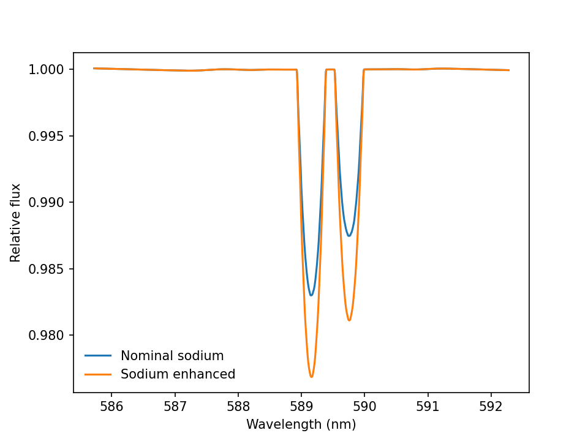
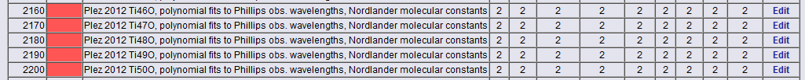

[](https://github.com/Hoeijmakers/StarRotator/actions/workflows/ci.yml) [](https://codecov.io/gh/Hoeijmakers/StarRotator)

# StarRotator

StarRotator is a python package that simulates a rotation-broadened stellar spectrum during an exoplanet transit event. The simulation is done via numerical integration of the stellar disk, with model photosphere spectra from either PHOENIX or pySME (optionally). The computationally heavy algorithms are JIT-compiled in Jax, allowing for fast evaluation and also for statistical inference using autodifferentiation e.g. using Numpyro.<br><br>

<b>A major update has recently been merged into the main branch. If you have used StarRotator before, you will experience changes with how to interact with the code.</b>


### This is a minimal guide for getting StarRotator installed and running.

In order to install and run StarRotator, perform the following steps:
1) Clone the repo / pull it to your machine.
2) From the root directory, you can install the full version of this package including pySME functionality using `pip` as: `pip install ".[sme]"` or `pip install -e ".[sme]"` if you intend to make code changes. Note that this will install all dependencies, including pySME. On some systems the latest version of the package `pysme-astro` may not install correctly if a C or fortran compiler is missing on your system. In this case you can still continue to install StarRotator without pySME functionality, install without the sme tag as: `pip install .`.
3) Open python and import the package: `from starrotator import StarRotator`.
4) StarRotator can now be called as `KELT9 = StarRotator()`. Without providing any system parameters as input, this will compute a model spectrum of the Na-D lines of assuming an exoplanet system that loosely resembles KELT-9 (a fast-rotating 8,000K A-star orbited by a gas giant), computed on a grid of (2x150)x(2x150) i.e. 300x300 square pixels. How to pass your own input parameters is explained below.
5) You can access the simulation output using attributes defined on the `KELT9` object: 
  - The wavelength axis of the model is accessed as `wl = KELT9.wl`. 
  - The ground-truth out-of-transit stellar spectrum as `F_out = KELT9.stellar_spectrum`.
  - The ground-truth spectral time-series as `spectra = KELT9.spectra`.
  - The out-of-transit stellar spectrum downgraded to spectral resolution `R` as: `F_out_conv = KELT9.F0`.
  - The spectral time-series downgraded to spectral resolution `R` as: `spectra_conv = KELT9.Ft`.
  - The white-light lightcurve and accompanying phases as: `lightcurve = KELT9.lightcurve` and `phases = KELT9.phases`.
  - The spectral residuals and the normalised residuals as `residuals = KELT9.residuals` and `residuals_norm = KELT9.residuals_norm`. These can also be plotted using the method `KELT9.plot_residuals()`.


### Parameter inputs
To change the parameters of your exoplanet system you can pass input parameters in a dictionary. See the example code block below.

```python
from starrotator import StarRotator
import numpy as np
input = {}
input['wavelength'] = [570,610,20000] # Wavelength min, max and N-steps.
input['wavelength_type'] = 'constant_dlogl' # Wavelength grid mode. Constant delta-log lambda is fastest, but other options are available: 'linear', 'explicit', 'minmax'.
input['phases'] = np.linspace(-0.1,0.1,61) # Exoplanet orbital phase array. The phases (+- 0.1 in this example) should encompass the transit event.
input['grid_size_star'] = 300 # Number of grid points of the star on a side. So 300 results in a 300x300 grid.
input['grid_size_planet'] = 100 # Number of grid points of the planet covering the planet on a side.
input['sma_Rs'] = 3.153 # Semi-major axis divided by stellar radius.
input['e'] = 0.0 # Eccentricity.
input['omega'] = 0.0 # Longitude of ascending node, for eccentric orbits only and can be omitted if e==0.
input['inclination'] = 89.0 # Inclination. 90 degrees is transiting.
input['obliquity'] = 45.0 # Spin-orbit misalignment in degrees. 0.0 is perpendicular to the stellar spin axis (projected).
input['RpRs'] = 0.1 # Transit radius (Rp/Rs)
input['Rstar'] = 1.4 # Stellar radius in solar radii.
input['P'] = 2.3 # Orbital period in days.
input['mp'] = 0.0 # Mass of the planet in Jupiter masses. Can be left to 0.0 unless stellar reflex motion is important for your application.
input['veq'] = 100.0 # Stellar equatorial velocity.
input['stelinc'] = 90.0 # Inclination of the stellar equator. veq*sin(stelinc) = vsin(i). 90 degrees places the spin axis in the plane of the sky.
input['T'] = 8000.0 # Stellar effective temperature.
input['FeH'] = 0.0 # Stellar metallicity.
input['logg'] = 4.5 # Stellar surface gravity log(g) cgs.
input['drr'] = 0.0 # Differential rotation parameter. 0.0 is no differential rotation.
input['u1'] = 0.93 # Limb darkening parameter linear.
input['u2'] = -0.23 # Limb darkening parameter quadratic.
input['R'] = 80000 # Spectral resolving power (lambda/delta-lambda).
input['model'] = 'PHOENIX' # Model type, PHOENIX or pySME are allowed.

KELT9 = StarRotator(input=input)
KELT9.plot_residuals(588.9,590)

```
<br>
Depending on your computing resources, this should run in several seconds and produce the following output:



<!-- If you have installed [Imagemagick](https://imagemagick.org/), the output can also be animated:
 -->
<br><br>

Alternatively, parameters can also be input as path to a JSON file, formatted as follows:
```json
{
    "wavelength": [570,610,20000],
    "wavelength_type": "constant_dlogl",
    "phases": [-0.1,-0.09,-0.08,-0.07,-0.06,-0.05,-0.04,-0.03,-0.02,-0.01,0.0,0.01,0.02,0.03,0.04,0.05,0.06,0.07,0.08,0.09,0.1],
    "grid_size_star": 300,
    "grid_size_planet": 100,
    "sma_Rs": 3.153,
    "e": 0.0,
    "inclination": 89.0,
    "obliquity": 45.0,
    "RpRs": 0.1,
    "Rstar": 1.4,
    "P": 2.3,
    "mp": 0.0,
    "veq": 100.0,
    "stelinc": 90.0,
    "T": 8000.0,
    "FeH": 0.0,
    "logg": 4.5,
    "drr": 0.0,
    "u1": 0.93,
    "u2": -0.23,
    "R": 80000,
    "model": "PHOENIX"
}
```


<br><br><br>

### A typical use case: running StarRotator with pySME as a forward model.

[PySME](https://github.com/SpectroscopyMadeEasy/PySME) is wrapped by StarRotator to allow a user to generate more precise forward-models of the Doppler-Shadow residuals. An important feature of pySME is that it allows the computation
of spectra with varying mu-angles (mu=cos(alpha) = 1.0 at disk center), wheras using a disk-integrated PHOENIX spectrum combined with limb darkening ignores the Center-to-limb variation (CLV). A computation done with pySME and mu-resolution
is as follows. Note that some pySME-specific keywords were added, while the limb darkening parameters (above) are removed.

```python

input = {}
input['wavelength'] = [580,600,10000]
input['wavelength_type'] = 'constant_dlogl'
input['phases'] = np.linspace(-0.1,0.1,61) 
input['grid_size_star'] = 300 
input['grid_size_planet'] = 100 
input['sma_Rs'] = 3.153 
input['e'] = 0.0 
input['inclination'] = 89.0 
input['obliquity'] = 45.0 
input['RpRs'] = 0.1 
input['Rstar'] = 1.4 
input['P'] = 2.3 
input['mp'] = 0.0 
input['veq'] = 100.0 
input['stelinc'] = 90.0 
input['T'] = 8000.0 
input['FeH'] = 0.0 
input['logg'] = 4.5 
input['drr'] = 0.0 
# input['u1'] = 0.93 
# input['u2'] = -0.23 
input['R'] = 80000 
input['model'] = 'pysme'
input['N_mu'] = 20 # The number of mu-angles by which to resolve the stellar disk.
input['small_planet'] = True # In the small-planet approximation, assume that the planet covers only a single mu-angle. Setting this to False is not yet supported.
input['grid_model'] = 'atlas12.sav' # pySME requires an atmosphere model, and atlas12 is one of the pre-packaged ones. See the pySME documentation for other options.
input['abund'] = {}

KELT9 = StarRotator(input=input)
```

<br><br><br>

<b> An important detail: </b> pySME requires a linelist as input. To carry out the above calculation of the sodium lines, a dummy linelist was packaged along with StarRotator that contains only the two Fraunhofer D-lines (`starrotator/data/demo_linelist.dat`). In real applications, the user needs to provide their own line-list in VALD format (see details below), as this format is hardcoded in StarRotator.

<br><br><br>

### Modified elemental abundances with pySME.

pySME allows the user to calculate a stellar spectrum with custom elemental abundances. In theory, it should be possible to precisely forward model the residual and recalibrate observed spectra of stars with non-solar elemental ratios. To model the rotation broadened Na lines in a sodium-rich variation on the KELT-9 system with pySME, you can add the abundance parameter to the input dictionary used above.

```python

import matplotlib.pyplot as plt
KELT9_normal = StarRotator(input=input)
input['abund'] = ["{'Na':6.6}"] # The nominal value is 6.4, following the Asplund scale.
KELT9_high = StarRotator(input=input)

plt.plot(KELT9_normal.wl,KELT9_normal.F0,label='Nominal sodium')
plt.plot(KELT9_high.wl,KELT9_high.F0,label='Sodium enhanced')
plt.legend(frameon=False)
plt.xlabel('Wavelength (nm)')
plt.ylabel('Relative flux')
plt.show()
```

This creates the following figure of the out-of-transit broadened stellar sodium lines. In addition, in reality you will wish to use more complete line-lists (in VALD format) and data-driven stellar and system parameters. All this is left for the user to explore.


<br><br><br>

### VALD service for atomic and molecular data. i.e. line lists


The Vienna Atomic Line Database (VALD) is a collection of atomic and molecular energy level transition parameters of astronomical interest. VALD provides tools to extract a list of energy level transition parameters, a so-called line list, within a given energy range (wavelength range). An email is required for registration, as this is where you recieve download links. Note that the service only works in wavelengths in air and species that are given with ionisation in integer format, i.e. Fe 1 for neutral iron.

You will find the service at this website: http://vald.astro.uu.se/~vald/php/vald.php

It is possible to view a very short range of wavelengths directly via the web interface, but the most interesting feature is the "Extract All" function, which allows you to download all energy level transitions in a given wavelength range.

A few tips on configuring your data request:
1) Choose "long format" for your data, as this will allow your synthesis code to access more information, which may be needed if you are modelling NLTE in spectroscopy, for example.
2) Choose FTP as your delivery platform, this is necessary above a certain size, which is not that large.
3) Yes, include HFS splitting unless you know you don't need it.
4) Don't require known values unless you know you will need them.
5) Choose a custom line list configuration (more details below).
6) Stick to the default units, as these are the units used in most popular spectral synthesis codes, in particular PySME.

#### Custom line list configuration

The data for some of the molecules is extensive and will quickly fill your download quota if you include them in your requests. In particular, the TiO data is a culprit, so it is highly recommended that you omit this molecule from your Extract All requests for most purposes.

The custom linelist configuration is attached to your login, so you only need to configure this once. You can click on "Linelist Configuration" on the Extract All page or go to
http://vald.astro.uu.se/~vald/php/vald.php?page=persconf

To remove the TiO lines go down to: Plez 2012 Ti46O, polynomial fits to Phillips obs. wavelengths, Nordlander molecular constants
You wlil see an "X" in the Active? column. Select Edit and remove the X. Do it for all isotopes. Afterwards it should look like this:


After the first query, check the wavelength of the last entry. If the last entry is not the desired final wavelength, make a new query starting from the last wavelength. If you end up with several files, simply stitch them together at the end. The headers will be the same in all files and must only be present once in the first two lines of the final file. Make sure that the references at the end of each file are collected at the end of the final file, as references in the middle of a line list file can confuse the PySME parser.

A VALD line list file typically looks like this:

```
                                                                     Lande factors        Damping parameters
Elm Ion       WL_air(A)  log gf* E_low(eV) J lo  E_up(eV) J up   lower   upper    mean   Rad.  Stark    Waals
'Fe 1',      3000.00258,  -4.771,  3.3009,  2.0,  7.4325,  3.0,  1.180,  0.720,  0.260, 7.310,-4.180,-7.320,
  LS                                                                      3d7.(2D2).4s a3D
  JK                                                              3d7.(4F<3/2>).4f 2[7/2]*
'_          Kurucz Fe I 2014   1 wl:K14   1 gf:K14   1 K14   1 K14   1 K14   1 K14   1 K14   1 K14   1 K14    Fe'
'Fe 1',      3000.02013,  -8.668,  3.3320,  5.0,  7.4636,  5.0,  1.400,  1.230,  1.310, 7.380,-3.590,-7.180,
  LS                                                             3d6.(5D).4s.4p.(3P*) z5F*
  JK                                                            3d6.4s.(6D<3/2>).5g 2[9/2]
'_          Kurucz Fe I 2014   1 wl:K14   1 gf:K14   1 K14   1 K14   1 K14   1 K14   1 K14   1 K14   1 K14    Fe'

[...skipping a lot of lines...]

'Fe 1',      4199.98361,  -5.305,  0.0873,  2.0,  3.0385,  2.0,  1.500,  2.330,  1.920, 3.140,-6.170,-7.820,
  LS                                                                           3d6.4s2 a5D
  LS                                                             3d6.(5D).4s.4p.(3P*) z7P*
'_          Kurucz Fe I 2014  11 wl:K14  11 gf:K14  11 K14  11 K14  11 K14  11 K14  11 K14  11 K14  11 K14    Fe'
'Ca 1',      4199.98872,  -2.561,  4.5347,  2.0,  7.4859,  2.0,  1.500,  1.180,  1.340, 7.510,-3.740,-6.880,
  LS                                                                         3p6.4s.5p 3P*
  LS                                                                          3p6.3d.7d 1D
'_      A   Kurucz CaI 2007    1 wl:K07   1 gf:K07   1 K07   1 K07   1 K07   1 K07   1 K07   1 K07   1 K07    Ca'
* oscillator strengths were scaled by the solar isotopic ratios.
 References:
  1. Kurucz obs. energy level: Fe 1
  2. Kurucz obs. energy level: Mn 2
  3. Kurucz obs. energy level: O 4
  4. Kurucz obs. energy level: Cr 2
[...can be many references...]
```


### Running StarRotator with your own model

Finally, it is possible to supply your own stellar spectrum, or mu-resolved stellar spectra. The below code example reads in a pre-packaged mu-resolved spectrum generated with pySME with 5 mu angles, and passes it into the input dictionary. For clarity, only the relevant dictionary keywords are shown, 
and are assumed to be the same as earlier.

```python
from importlib.resources import files
from starrotator import StarRotator
import numpy as np
import matplotlib.pyplot as plt

#Below is the location of the input spectrum file, which is an ascii table.
inpath = files("starrotator.data").joinpath("demo_input_spectra.dat")
wl_in, *fx_in = np.loadtxt(inpath, unpack=True,comments='#')
fx_in = np.array(fx_in)

with open(inpath) as f:
    f.readline()  # Skip first header
    mu = np.array(f.readline()[4:].split(' ')[1:-1],dtype=float) #This parses the mu angles in the second line of the file.


#Run a simulation with the demo file.
input = {}
input['wavelength'] = wl_in # This is a numpy array that contains your wavelength grid, matching the flux grid.
input['wavelength_type'] = 'explicit'
input['model'] = 'custom'
input['model_fx'] = fx_in # This is 
input['mu_array'] = mu   

KELT9 = StarRotator(input=input)
```